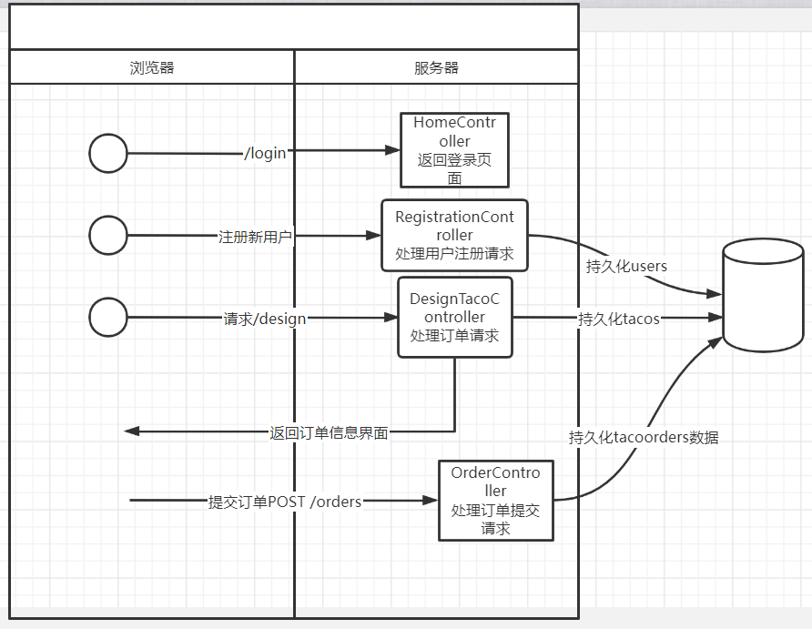

# bookspringinaction5

这是学习《Spring实战》（第五版）的学习记录仓库

# 前七章整理

## 1. 前端界面使用angular；

导航组件为：header.component.html；

查看每个导航链接的路由：app.routes.ts；

## 2. 数据库表结构：

1. Ingredient：

```sql
CREATE TABLE `Ingredient` (
   `id` varchar(4) NOT NULL,
   `name` varchar(25) NOT NULL,
   `type` varchar(10) NOT NULL
 ) ENGINE=InnoDB DEFAULT CHARSET=utf8mb4
```

2. Taco：

```sql
CREATE TABLE `Taco` (
   `id` bigint(20) NOT NULL AUTO_INCREMENT,
   `name` varchar(50) NOT NULL,
   `createdAt` timestamp NOT NULL DEFAULT CURRENT_TIMESTAMP ON UPDATE CURRENT_TIMESTAMP,
   PRIMARY KEY (`id`)
 ) ENGINE=InnoDB AUTO_INCREMENT=18 DEFAULT CHARSET=utf8mb4
```

3. Taco_Ingredient：

```sql
CREATE TABLE `Taco_Ingredient` (
   `taco` bigint(20) NOT NULL,
   `ingredient` varchar(4) NOT NULL
 ) ENGINE=InnoDB DEFAULT CHARSET=utf8mb4
```

## 3. Taco，Ingredient实体类使用Spring JPA持久化机制：

需要设置JPA的逻辑实体名称与物理表的映射关系：（配置数据库表和字段是否需要做转换，比如驼峰命名的字段，使用下划线：createdAt->
created_at）

```yaml
spring:
	jpa:
    hibernate:
      naming:
        implicit-strategy: org.hibernate.boot.model.naming.ImplicitNamingStrategyComponentPathImpl
        physical-strategy: org.hibernate.boot.model.naming.PhysicalNamingStrategyStandardImpl
```

- Taco实体类的表名为：Taco；
- Ingredient实体类的表名为：Ingredient；
- 在使用JPA的情况下，如果需要关联查询，使用@ManyToMany注解的时候，可以指定关联关系所在的数据库表；然后使用@JoinTable进行指定，并指定关联实体之间的join方式：

```java
@Data
@Entity
@RestResource(rel = "tacos", path = "tacos")
public class Taco {
    @Id
    @GeneratedValue(strategy = GenerationType.IDENTITY)
    private Long id;

    private Date createdAt;
    private String name;
    @ManyToMany // 默认的连接表为taco_ingredient
    @JoinTable(
            joinColumns = @JoinColumn(name = "taco", referencedColumnName = "id"), // owning side
            inverseJoinColumns = @JoinColumn(name = "ingredient", referencedColumnName = "id")
    )
    private List<Ingredient> ingredients;
}
```

## 4. REST API的暴露：

- 使用JPA，并且添加了spring-boot-starter-data-rest依赖，则会自动将JPA Repository暴露为Rest API端点；

查看暴露的所有端点，访问路径为：localhost:8080/api；

工程：tacocloud-data；

- 使用Hateoas暴露REST API，将taco和Ingredient封装成资源RepresentationModel，然后通过RepresentationModelAssemblerSupport，为资源添加link链接；
  - ~~将design暴露为REST；~~
  - 将Ingredient暴露为REST；

访问路径为：localhost:8080/hateoas/design/recents；

工程：tacocloud-api；

# 第八章

添加工程：

- tacocloud-messaging-rabbit：使用rabbitmq；向mq发送order；
- tacocloud-kitchen：接收rabbitmq队列的消息；手动的接收/监听接收；

发送到rabbitmq的消息使用Jackson2JsonMessageConverter的messageconverter实例；

> 需要注意，order中有user对象的数据，而user是一个userservice；默认json转化的时候，user对象，会生成一个：
>
> ```json
>         "authorities": [
>             {
>                 "authority": "USER"
>             }
>         ]
> ```
>
>
的json数据，在接收当队列数据，转换为order的时候，这个json结构会转换失败；可以选择在将order转换为json的时候，不json化authorities字段：添加` @JsonIgnore`
注解：
>
> ```java
>     @JsonIgnore
>     @Override
>     public Collection<? extends GrantedAuthority> getAuthorities() {
>         return Arrays.asList(new SimpleGrantedAuthority("USER"));
>     }
> ```
>
>

当创建完订单之后，访问：`http://localhost:8080/orders/receive`，可以获取队列中的order数据；

# 第十二章 反应式持久化数据

1. 反应式的编程，直到数据被subscribe之后，动作才会实际执行；比如save的时候，如果只是调用了save，实际上没有执行保存操作，需要subscribe该操作的返回值，动作才会实际执行；

## cassandra

**开发步骤：**

1. docker 安装和运行cassandra：

```shell
## 拉取镜像
docker pull cassandra:4.0.6

## 创建容器
docker run --name mycassandra -v /mydata/cassandra/datadir:/var/lib/cassandra -p 9042:9042 -d cassandra:4.0.6

##进入容器
docker exec -it mycassandra /bin/bash
## 执行cqlsh:
root@004b946a119e:/# cqlsh
Connected to Test Cluster at 127.0.0.1:9042
[cqlsh 6.0.0 | Cassandra 4.0.6 | CQL spec 3.4.5 | Native protocol v5]
Use HELP for help.
cqlsh> 
```

2. Spring Boot配置：

添加依赖：

```xml

<dependency>
  <groupId>org.springframework.boot</groupId>
  <artifactId>spring-boot-starter-data-cassandra-reactive</artifactId>
</dependency>
```

添加配置文件配置：

```yaml
spring:
  data:
    cassandra:
      local-datacenter: datacenter1
      keyspace-name: tacocloud
      contact-points:
        - 192.168.61.130:9042
      schema-action: recreate_drop_unused
```

3. 配置repository；

**代码请求测试流程：**



遗留问题：

1. webflux登陆之后，自动重定向到"/"路径？？
2. http://localhost:8080/orders请求，如何获取到cassandra中的数据，如何编写repository查询？？
